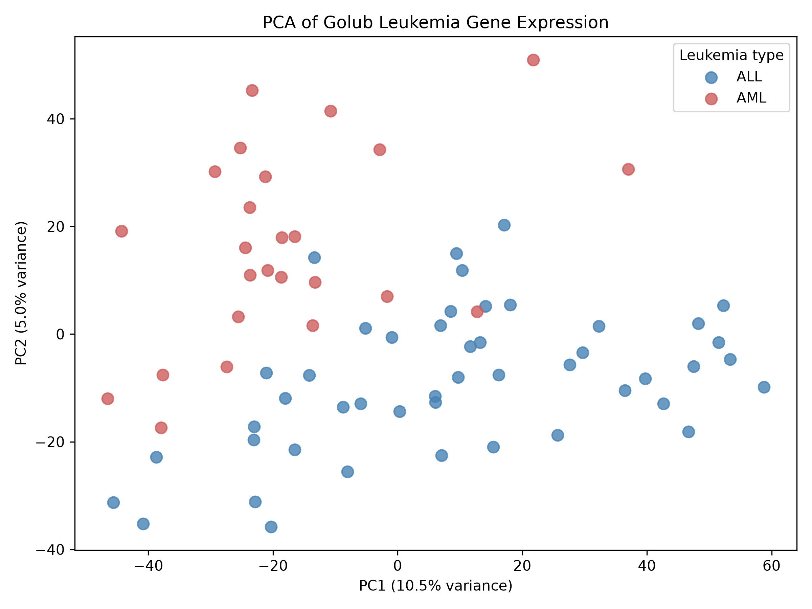
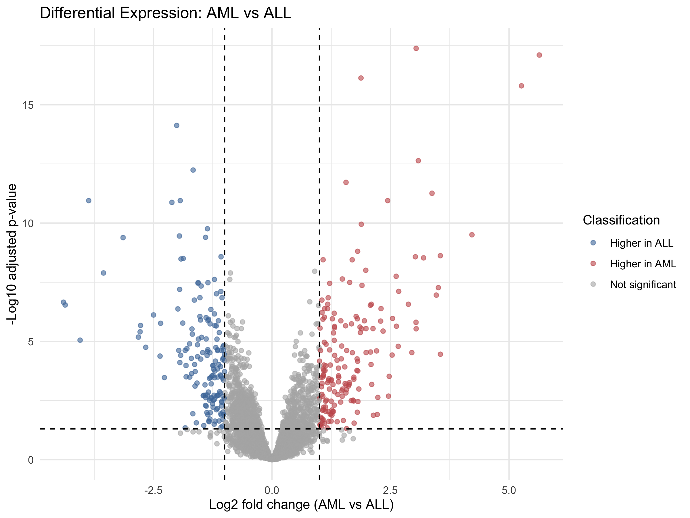
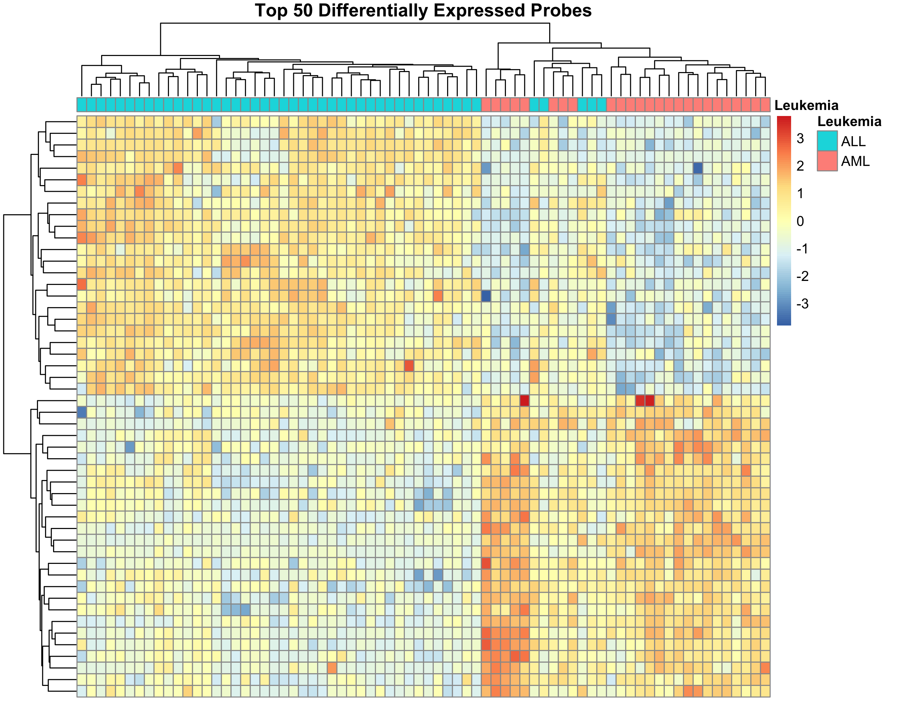

# leukemia-expression-analysis
Reproducible analysis of leukemia gene-expression data using R, Python, statistical learning and bioinformatics workflows.

## Project Overview

This project explores gene-expression differences between acute lymphoblastic leukemia (ALL) and acute myeloid leukemia (AML) using the publicly available Golub leukemia dataset. The goal of this project is to develop a reproducible bioinformatics workflow and investigate how expression patterns differ between the two leukemia types.

The analysis combines R and Python to perform data validation, variance-stabilizing normalization, principal component analysis (PCA), differential-expression testing, and visualization. Gene symbols are mapped to significant probe sets to support biological interpretation.

Note: This is a personal project to demonstrate my skills. It is not intended for clinical diagnosis or to establish new biomarkers.

## Dataset

This project uses the Golub leukemia gene-expression dataset, originally published by Golub et al. (1999).

The dataset contains 7,129 microarray probe sets measured across 72 leukemia samples: 47 acute lymphoblastic leukemia (ALL) samples and 25 acute myeloid leukemia (AML) samples.

**Original publication:** Golub TR et al. (1999). *Molecular Classification of Cancer: Class Discovery and Class Prediction by Gene Expression Monitoring*. Science, 286, 531–537.

**Data source:** https://bioconductor.org/packages/golubEsets/

## Methods

### Data validation and normalization

The expression matrix and sample metadata were extracted from `Golub_Merge`. Sample identifiers, group counts, and missing values were checked before analysis. Variance-stabilizing normalization was performed using the Bioconductor `vsn` package, and a mean–SD diagnostic plot was generated to assess the normalized data.

### Principal component analysis

Python was used to perform principal component analysis (PCA) on the expression data. The first two principal components were visualized to compare ALL and AML samples.

### Differential expression

Differential-expression analysis was performed using `limma` to compare AML and ALL samples.. P-values were adjusted for multiple testing using the Benjamini–Hochberg method.

Probe sets were considered significant when they met both criteria:

* Adjusted p-value < 0.05
* Absolute log2 fold change > 1

### Visualization and annotation

A volcano plot was created to display differential-expression results. A heatmap was generated using the 50 probe sets with the lowest adjusted p-values to compare expression patterns between ALL and AML samples.

Significant probe sets were mapped to their corresponding gene symbols, and the top 20 results were selected for further analysis.

## Results

### Differential-expression summary

The analysis identified 328 significant probe sets, with 170 showing higher expression in AML and 158 showing higher expression in ALL. Of these, 314 were mapped to gene symbols, while 14 remained unmapped.

### Principal component analysis

The PCA showed separation between ALL and AML samples. The first two principal components explained approximately **10.5% and 5.0%** of the total variance.

### Volcano plot

The volcano plot shows differences in gene expression between AML and ALL samples.

### Heatmap

The heatmap shows expression patterns across the top 50 differentially expressed probe sets in ALL and AML samples.

### Selected annotated findings

Highly ranked annotated probe sets included **CD33, MPO, CFD, CST3, DNTT, and TCF3**.

## Reproducibility

### Requirements

The analysis was performed using **R and Python**, with packages including `limma`, `vsn`, `golubEsets`, pandas, scikit-learn, and Matplotlib.

## Limitations

This analysis uses a historical dataset with 72 samples, so the results may not generalize to other patient populations. The findings are exploratory and have not been independently or clinically validated.

## References

1. Golub TR, Slonim DK, Tamayo P, et al. (1999). Molecular Classification of Cancer: Class Discovery and Class Prediction by Gene Expression Monitoring. *Science*, 286, 531–537. https://doi.org/10.1126/science.286.5439.531

2. Bioconductor. `golubEsets`: Golub leukemia data. https://bioconductor.org/packages/golubEsets/

3. Ritchie ME, Phipson B, Wu D, et al. (2015). limma powers differential expression analyses for RNA-sequencing and microarray studies. *Nucleic Acids Research*, 43(7), e47. https://doi.org/10.1093/nar/gkv007

4. Huber W, von Heydebreck A, Sültmann H, Poustka A, Vingron M. (2002). Variance stabilization applied to microarray data calibration and to the quantification of differential expression. *Bioinformatics*, 18(Suppl 1), S96–S104. https://doi.org/10.1093/bioinformatics/18.suppl_1.S96
